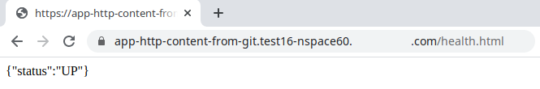

# app-http-content-from-git

Test application with HTTP content in html folder synchronised from git repository


health.html is used for monitoring



## Manual build

Update .env file

Navigate to the project directory end run
```bash
./docker-build.sh
```

on Mac
```bash
bash ./docker-build.sh
```

## CI build

Use Jenkinsfile in Jenkins application


The code stored on internal GitLab

/info.json file will be created by Jenkins


Docker image would be stored in AWS ECR


## Deployment

Deployment is done by Jenkins from [aws-eks-vpc-3priv-3pub-3db-3front-sn](https://github.com/Vadim-Zenin/aws-eks-vpc-3priv-3pub-3db-3front-sn) repository.
